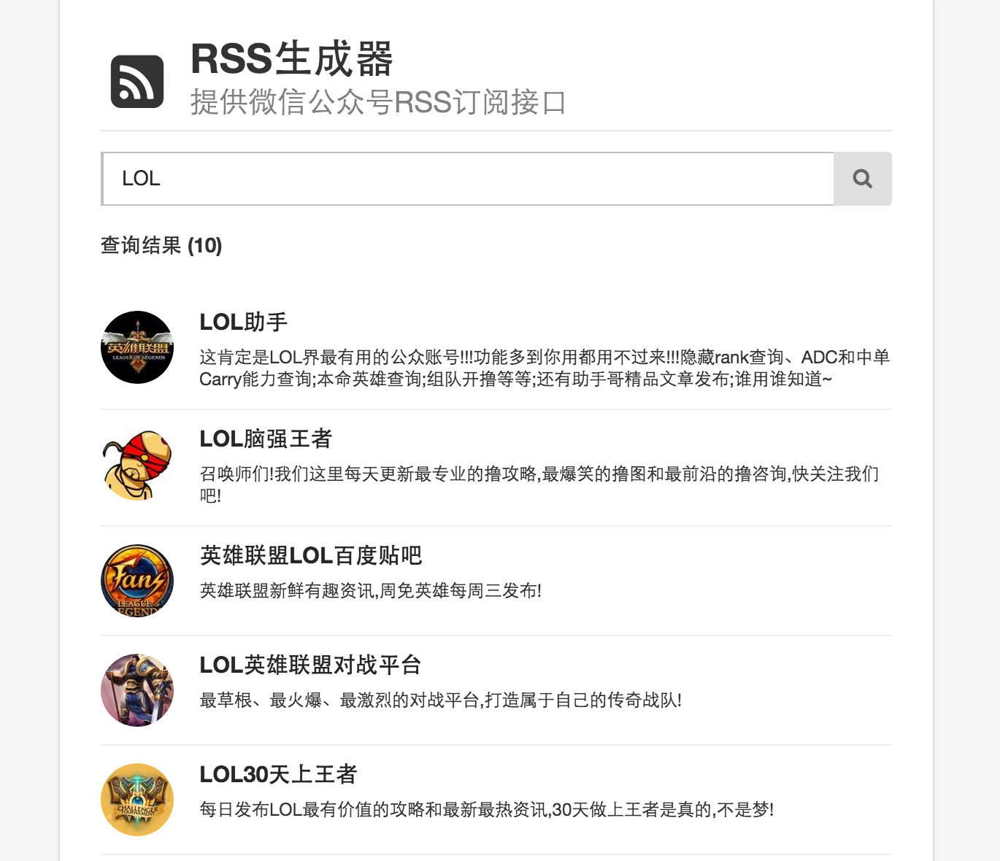

# rss
提供微信公众号RSS订阅接口，基于nodejs koajs开发

演示地址：[http://rss.wlwr.net](http://rss.wlwr.net)

注意：因演示地址访问量过多，服务器IP被搜狗加入黑名单，故不定期关闭演示地址。建议取代码搭建在自己服务器上。

## 更新日志

- 2015.04.26 搜狗接口变更 (已修复) 
    1. 去掉 `phantomjs` 依赖，不再需要定时生成cookie池 (好消息)
    2. 以前搜狗的openid标识失效，改用微信号ID作为标识 (坏消息)

- 2015.10.20 搜狗调整加密请求方式 (已修复)

- 2015.08.11 增加微信账号查询功能

- 2015.06.28 cookie池采集采用 `phantomjs`，及 加密盐值采集

- 2015.05.22 搜狗微信接口做了加密处理，导致采集失败。(已修复)

---

## 搭建

- 安装 `io.js` 或 `Node.js 0.11` 以上版本，才支持 ES6相关语法

- 安装 `redis-server` 端，默认端口是 `6379`

进入项目根目录, `npm install`，然后 `node --harmony app.js` 即可启动

----

## 截图：

